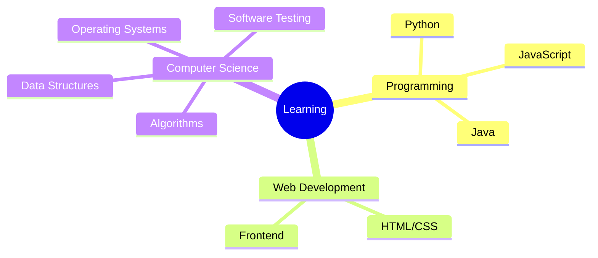

# Hi there, I'm ChenYisen 👋

---

---

## 🙋‍♂️ About Me

| 🎓 | Student Developer |
|:--:|:--:|
| 🏫 | Studying at **CWNU** |
| 💻 | Passionate about **Web Development** & **Algorithms** |
| 🌱 | Currently learning **Python**, **JavaScript** & **Java** |
| 📫 | Feel free to explore my projects! |

---

## 🛠️ Tech Stack

### Languages

### Tools & Platforms

---

## 🚀 My Projects

### 📌 Pinned Projects

### 📂 All Repositories

| Repository | Description | Language | Stars |
|------------|-------------|----------|-------|
| [**CodeCal**](https://github.com/ChanYeeSum/CodeCal) | ACM Online Judge API for competitive programming | Python | ⭐ |
| [**festival-greetings**](https://github.com/ChanYeeSum/festival-greetings) | Beautiful holiday greeting cards web application | JavaScript | |
| [**ChanYeeSum.github.io**](https://github.com/ChanYeeSum/ChanYeeSum.github.io) | Personal portfolio website on GitHub Pages | HTML | |
| [**Data**](https://github.com/ChanYeeSum/Data) | Learning materials and course projects from CWNU | - | |

### 🔗 Quick Links

---

## 📊 Learning Journey

- 🌱 Currently exploring **Algorithm & Data Structures**
- 📚 Learning **Software Testing** & **Operating Systems**
- 💻 Practicing **Python**, **JavaScript** & **Java**
- 🎯 Goal: Become a full-stack developer

---

## 💡 Fun Facts

| 📖 | I love reading code as much as writing it |
|:--:|:--:|
| 🎮 | Coding is my favorite game |
| ☕ | Coffee + Code = Perfect Day |
| 🚀 | Always ready to learn something new |

---

## 📈 Activity Graph

---

### 📫 Let's Connect!

**Thanks for visiting! ⭐**

